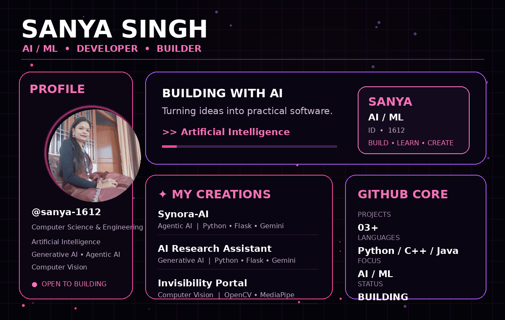
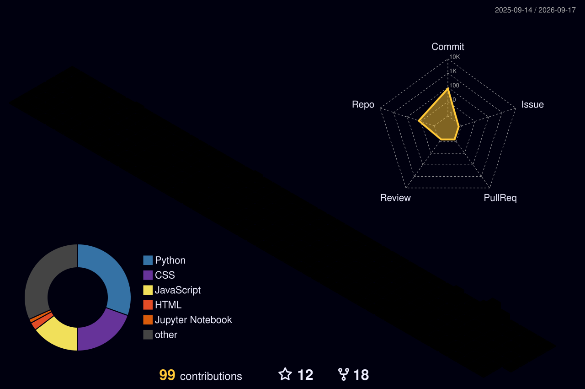

# 👋 SANYA SINGH RATHORE

### 💗 AI / ML • Generative AI • Agentic AI • Computer Vision

---

# 🌌 ABOUT ME

🎓 Computer Science & Engineering Student  
🤖 Interested in Artificial Intelligence & Machine Learning  
💻 Building practical software and AI applications  
✨ Exploring Generative AI and Agentic AI  
👁️ Working with Computer Vision and real-time applications  
📍 Kanpur, Uttar Pradesh, India

---

# 🚀 MY CREATIONS

## 🤖 SYNORA-AI

### `AGENTIC AI • GENERATIVE AI`

An Agentic AI project exploring intelligent task handling and AI-powered interaction.

**Tech Stack**

---

## 🔬 AI RESEARCH ASSISTANT

### `GENERATIVE AI • RESEARCH • FLASK`

An AI-powered research assistant designed to interact with research content using Generative AI.

**Tech Stack**

---

## 🪄 AI MAGIC INVISIBILITY PORTAL

### `COMPUTER VISION • REAL TIME • HAND GESTURES`

A computer-vision project using webcam interaction, hand gestures and real-time visual processing.

**Tech Stack**

---

# 💻 TECH STACK

---

# 📊 GITHUB STATS

---

# 🔥 GITHUB STREAK

---

# 🧊 3D CONTRIBUTION GRAPH

  

---

# 🐍 CONTRIBUTION SNAKE

  

---

# 🧠 CURRENTLY EXPLORING

### 🤖 ARTIFICIAL INTELLIGENCE

### 🧠 MACHINE LEARNING

### ✨ GENERATIVE AI

### 🕹️ AGENTIC AI

### 👁️ COMPUTER VISION

### 🚀 REAL-WORLD AI APPLICATIONS

---

# 🤝 CONNECT WITH ME

### 💻 GitHub

### 💼 LinkedIn

### 📧 Email

### 📸 Instagram

### 🧩 LeetCode

### 🏆 HackerRank

---

# 🌌 BUILD • LEARN • CREATE

### 💗 Always learning • Always building • Always improving
